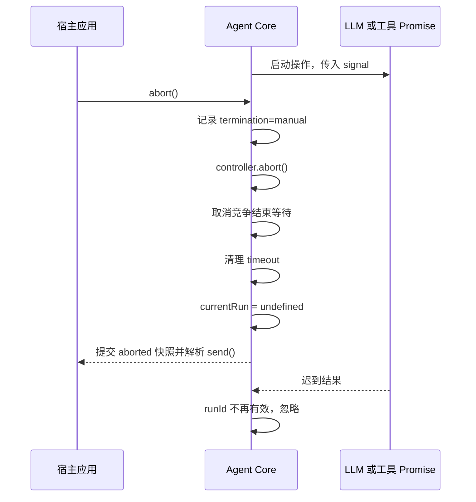

# Karkata 任务取消与超时协议

## 1. 目的

本文定义 Karkata 如何在 LLM Adapter 或用户工具忽略 `AbortSignal`、长时间不返回时，仍然保证 Agent 运行和 `send()` 在有限时间内收敛。

本协议保证的是 Agent Runtime 停止等待并忽略迟到结果，不保证一定能终止外部副作用或同线程同步代码。

## 2. 术语

| 术语 | 含义 |
| --- | --- |
| 协作式取消 | 底层操作监听 `AbortSignal` 并自行停止 |
| Runtime 收敛 | Agent 不再等待底层 Promise，提交终态并解析 `send()` |
| 迟到结果 | Runtime 已终止后，底层 Promise 才解析或拒绝 |
| 任务截止时间 | `send()` 开始时间加 `timeoutMs` |

## 3. 对外语义

### 3.1 手动取消

```ts
const resultPromise = agent.send('执行任务')
agent.abort()
const result = await resultPromise
```

结果：

```ts
{
  status: 'aborted',
  runId: string,
  steps: number,
}
```

Agent 状态进入 `aborted`，内部错误代码为 `ABORTED`。

### 3.2 整体超时

整体超时使用同一个 `AbortController` 通知底层停止，但对外是运行错误：

```ts
{
  status: 'error',
  runId: string,
  error: { code: 'TIMEOUT', message: string },
  steps: number,
}
```

Agent 状态进入 `error`，不进入 `aborted`。

### 3.3 非运行状态

`abort()` 在 `idle`、`completed`、`error`、`aborted` 或 `disposed` 状态下是幂等空操作。

## 4. 运行级取消控制器

每次 `send()` 创建一个独立的运行上下文：

```ts
interface RunContext {
  runId: string
  controller: AbortController
  signal: AbortSignal
  deadline: number
  termination?: 'manual' | 'timeout' | 'dispose'
}
```

- `abort()` 将 `termination` 设为 `manual` 并调用 `controller.abort()`。
- 截止时间到达时将 `termination` 设为 `timeout` 并调用 `controller.abort()`。
- `dispose()` 在运行中将 `termination` 设为 `dispose` 并调用 `controller.abort()`。
- 第一个终止原因生效，后续不覆盖。

## 5. 可收敛的等待原语

仅将 `signal` 传给 Promise 不足以保证收敛。Agent 对每个外部异步操作都必须使用取消竞争：

```ts
function awaitWithAbort<T>(
  operation: Promise<T>,
  signal: AbortSignal,
): Promise<T> {
  if (signal.aborted) {
    return Promise.reject(createAbortError())
  }

  return new Promise<T>((resolve, reject) => {
    const onAbort = () => reject(createAbortError())
    signal.addEventListener('abort', onAbort, { once: true })

    operation.then(
      (value) => {
        signal.removeEventListener('abort', onAbort)
        if (!signal.aborted) resolve(value)
      },
      (error) => {
        signal.removeEventListener('abort', onAbort)
        if (!signal.aborted) reject(error)
      },
    )
  })
}
```

该原语必须包装：

- `LLMAdapter.invoke()`。
- 每个 `Tool.execute()`。
- 可选上下文 Provider。
- `resolveInstructions()` 动态指导函数。
- `contextBudget.estimateTokens()` 上下文 token 估算器。
- `contextBudget.compaction.compactHistory()` 历史压缩回调。
- Human-in-the-Loop 用户回答等待。
- Runtime 中任何可能长时间等待的用户回调。

上述代码是语义示意。实现还应在竞争结束后附加空的 rejection handler 或等价处理，保证迟到的 operation rejection 不会形成未处理 Promise rejection。

## 6. 迟到结果隔离

Runtime 一旦因手动取消或超时停止等待，底层操作的任何迟到结果都必须被忽略：

- 不追加 assistant 消息。
- 不追加工具结果。
- 不增加步数。
- 不更新 `activeTool`。
- 不修改最终 `AgentResult`。
- 不向订阅者发送新运行状态。
- 不调用后续 LLM，也不提交 Resolver 的迟到指导。
- 不提交迟到的上下文估算或更新 `contextUsage`。
- 不提交迟到的压缩候选，不重新估算候选，也不调用后续 LLM。
- 不接受迟到的 Human-in-the-Loop 回答，也不恢复旧运行或追加回答 Tool Result。

每个异步续体在提交状态前必须确认：

```ts
if (agent.currentRun?.runId !== run.runId || run.signal.aborted) {
  return
}
```

这个 `runId` 门禁还可以防止上一次运行的迟到回调污染已经开始的新运行。

Human-in-the-Loop 的 `respond(requestId, answer)` 是额外的同步线性化点：只有请求 ID 与当前运行的唯一未决请求匹配，且 signal 尚未终止时才接受一次。公开请求中的 `callId` 只用于关联原 `ask_user` Tool Call，不替代 `requestId` 的回答权。取消、超时或 dispose 完成清理后，同一请求 ID 永久返回 `false`。用户等待不创建独立计时器，继续受整次运行的 `timeoutMs` 约束。

## 7. 状态提交顺序



终态提交必须是幂等的。手动取消、超时和底层错误可能在相近时间到达，但只有第一个完成终态提交的路径生效。

## 8. `dispose()` 语义

`dispose()` 需要与取消一样可等待：

```ts
dispose(): Promise<void>
```

- 重复调用返回同一个已完成或正在完成的 Promise。
- 如果正在运行，以 `dispose` 原因触发取消并等待 `send()` 运行收敛。
- 被 `dispose()` 终止的 `send()` 仍解析为 `status: 'aborted'`，使调用方不会永久等待。
- 清理超时器、会话历史、工具注册和订阅者。
- 最终状态为 `disposed`。
- 之后的 `send()`、工具写操作和历史操作都抛出 `AgentDisposedError`。

`dispose` 不是普通用户中断。它不向订阅者短暂提交 `aborted` 快照，而是在运行收敛和资源清理后直接提交 `disposed`。`send()` 的返回值和 Agent 的最终可观测状态因此分别是 `aborted` 和 `disposed`。

## 9. 无法强制中断的边界

### 9.1 忽略 `AbortSignal` 的异步工具

Runtime 可以及时停止等待，但工具内部的 HTTP 请求、定时器或其他副作用可能继续。因此工具契约必须要求实现方传递并响应 `ToolContext.signal`。

### 9.2 同线程同步死循环

如果工具在浏览器主线程中执行纯同步死循环，事件循环无法运行，`abort()`、超时器和 Promise 竞争都无法生效。执行不可信 JavaScript 必须使用可终止的 Worker、iframe 或服务端沙箱。

## 10. 测试要求

必须覆盖：

- LLM Promise 永不解析时，`abort()` 仍使 `send()` 及时返回 `aborted`。
- 工具 Promise 永不解析时，整体超时仍使 `send()` 返回 `error/TIMEOUT`。
- 取消后工具迟到 resolve 或 reject 不改变历史和状态。
- 旧运行的迟到回调不会污染新运行。
- 压缩回调忽略 signal 时，手动取消和整体超时仍及时收敛；迟到候选不替换已提交历史或更新占用状态。
- 手动取消与超时同时发生时，只提交一个终态。
- `dispose()` 在运行中调用时可等待且最终禁用 Agent。

## 11. 验收条件

- 任何一个忽略 `AbortSignal` 的异步依赖都不会让 Agent 永久卡在 `running`。
- `send()` 在手动取消或超时后可在一个微任务调度周期附近收敛，不等待底层操作完成。
- 任务终态、历史和订阅状态不会被迟到结果覆盖。
- 文档明确区分 Runtime 停止等待与外部副作用真正终止。
