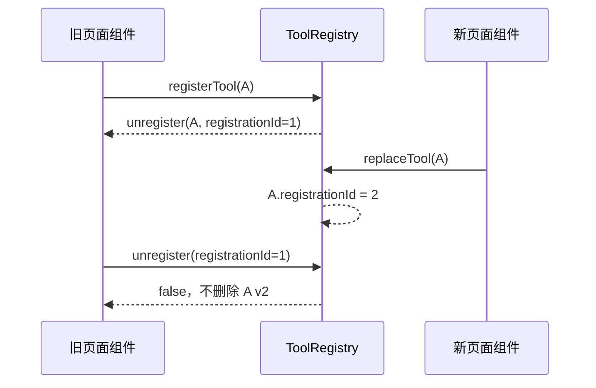
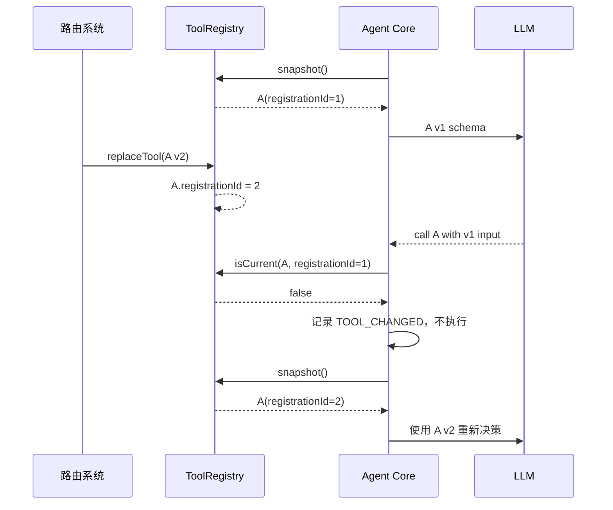

# Karkata 工具注册与版本一致性

## 1. 目的

本文定义 Tool Registry 的注册、替换、注销、作用域和快照一致性契约，重点解决路由切换与工具热插拔中的两类竞态：

1. 模型根据旧 Schema 生成参数，却被交给同名的新工具实现。
2. 旧组件的解注册回调在新工具注册后运行，误删新记录。

路由切换只是作用域更新的一种示例。scope 本质上是使用方定义的任意非空分组键，也可以表示页面、模块、租户、插件或工作流阶段；Core 不解析其业务含义。

## 2. 核心决策

- 工具成功输出必须符合公开 `ToolOutput`：JSON 风格的标量、递归数组或普通对象，不允许 `void` 和 `undefined`。
- 纯操作工具显式返回最小确认对象；涉及敏感业务数据时先映射为安全 DTO，再交给模型。
- `defineTool()` 对推断输出做递归类型校验，但 TypeScript 约束不能替代 Runtime 校验；非有限数字、非普通对象、symbol 属性、循环引用和显式类型绕过仍转换为 `TOOL_EXECUTION_ERROR`。

- 每次注册都生成唯一的 `registrationId`，即使工具名称不变。
- 模型请求使用的工具快照保留 `name + registrationId + schema + execute` 的一致组合。
- 执行 Tool Call 时使用该快照内的 Schema 与实现，不按名称重新取最新实现。
- 执行前检查快照记录是否仍是当前有效注册；不一致时返回 `TOOL_CHANGED`，不执行旧或新实现。
- 解注册回调绑定 `registrationId`，不按名称盲删。

## 3. 数据模型

```ts
export type ToolScope = string
export type RegistrationId = string

interface ToolRegistration<TInput = unknown, TOutput = unknown> {
  readonly registrationId: RegistrationId
  readonly scope: ToolScope
  readonly tool: Tool<TInput, TOutput>
}

interface ToolSnapshot {
  readonly registryRevision: number
  readonly registrations: ReadonlyMap<string, ToolRegistration>
}
```

`registryRevision` 用于调试和快照识别，不能代替 `registrationId`。任意一个无关工具更新都会增加全局 revision，但不应因此使其他工具失效。

## 4. 作用域与名称冲突

### 4.1 首版规则

- 默认作用域名称为 `global`。
- 有效工具集合在所有作用域之间也必须名称唯一。
- 任意作用域中的工具都不会隐式覆盖全局工具。
- 所有按名称的写操作都需显式指定作用域，避免删除错误记录。
- `replaceToolScope()` 先在内存中验证新集合内部及其他作用域的名称冲突，全部通过后再原子提交。

建议 API：

```ts
registerTool(tool: Tool, options?: { scope?: string }): UnregisterTool
unregisterTool(name: string, options?: { scope?: string }): boolean
replaceTool(tool: Tool, options?: { scope?: string }): void
replaceToolScope(scope: string, tools: readonly Tool[]): void
listTools(options?: { scope?: string }): readonly RegisteredToolInfo[]
listToolScopes(): readonly string[]
removeToolScope(scope: string): number
```

构造时可通过 `AgentConfig.tools` 原子批量注册初始工具：

```ts
tools: [
  globalTool,
  { tool: auditTool, scope: 'workflow-review' },
]
```

普通 Tool 使用 `global` scope，注册项使用显式 scope。整个初始化批次必须先完成校验和名称冲突检查，再一次提交；失败时不产生部分注册。

### 4.2 作用域生命周期与查询

Registry 独立维护已创建的 scope，而不是每次从非空工具集合推导：

- `global` 在 Agent 构造时创建，即使没有全局工具也会被 `listToolScopes()` 返回。
- 构造注册、`registerTool()` 和 `replaceToolScope()` 可以创建 scope。
- `unregisterTool()` 删除最后一个工具或 `replaceToolScope(scope, [])` 清空工具后，scope 仍然存在。
- `removeToolScope()` 是删除 scope 实体的唯一公开 API，同时原子删除其中全部工具。
- 所有 scope 采用相同规则，`global` 也可以显式删除。

`listTools()` 返回冻结的信息数组，每项只包含 `name`、`description` 和 `scope`；它不暴露 `execute`、`inputSchema`、`registrationId` 或内部 Map。`listTools({ scope })` 只过滤指定 scope。旧查询结果不随后续注册表变化。

## 5. 注册和解注册语义

```ts
type UnregisterTool = () => boolean
```

`registerTool()` 的处理流程：

1. 校验工具名称、描述、Schema 和 `execute`。
2. 检查所有作用域是否已有同名工具。
3. 生成新 `registrationId`。
4. 提交新记录并增加 `registryRevision`。
5. 返回闭包，其中保留 `name`、`scope` 和 `registrationId`。

解注册回调仅在当前记录的 `registrationId` 仍等于闭包中的 ID 时删除工具。否则返回 `false`，不修改注册表。多次调用同一解注册函数是安全的。



## 6. 快照与执行一致性

### 6.1 单步快照

Agent 在每次 LLM 调用前创建一个 `ToolSnapshot`。该快照用于：

- 生成本次 LLM 请求中的工具定义。
- 校验模型返回的工具参数。
- 定位应执行的工具实现。

这三个操作必须使用同一条 `ToolRegistration`。

### 6.2 执行前校验

```ts
const snapshotted = snapshot.registrations.get(call.name)

if (!snapshotted) {
  return toolError(call, 'TOOL_NOT_FOUND')
}

const current = registry.get(call.name)

if (!current || current.registrationId !== snapshotted.registrationId) {
  return toolError(call, 'TOOL_CHANGED')
}

const input = snapshotted.tool.inputSchema.parse(call.input)
return snapshotted.tool.execute(input, context)
```

若同名工具在 LLM 思考期间被替换，Agent 既不用旧实现执行，也不把旧参数交给新实现，而是返回可恢复的 `TOOL_CHANGED` 工具错误，下一步使用最新工具快照让模型重新决策。

### 6.3 时序



## 7. 作用域原子替换

`replaceToolScope(scope, tools)` 必须满足全成功或全失败：

1. 在不修改当前注册表的前提下构建候选集合。
2. 验证候选集合内部名称唯一。
3. 验证与其他作用域无名称冲突。
4. 为候选集合中的每个工具生成新 `registrationId`。
5. 一次性替换该作用域并只增加一次 `registryRevision`。

即使新旧工具对象相同，作用域替换也会产生新注册 ID。这使语义可预测：一次路由作用域更新会使该作用域的旧快照全部失效。

## 8. 已开始工具的处理

工具通过执行前版本检查后，就不会因后续注册表变更被自动取消。工具依然使用当前任务的 `AbortSignal`，但只有任务中断或超时才会触发该信号。

这是刻意的线性化点：执行前检查通过后，该次工具执行属于旧版本已经接受的工作。

## 9. 错误与可恢复性

| 错误代码 | 含义 | 运行行为 |
| --- | --- | --- |
| `TOOL_NOT_FOUND` | 快照本身不包含模型请求的工具 | 记录工具错误并重新决策 |
| `TOOL_CHANGED` | 快照记录已被删除或替换 | 记录工具错误并重新决策 |
| `TOOL_INVALID_INPUT` | 参数不符合快照 Schema | 记录工具错误并重新决策 |
| `TOOL_EXECUTION_ERROR` | 工具实现抛错 | 记录工具错误，由模型决定后续处理 |

工具错误不默认结束整个运行，但仍计入 `maxSteps` 和整体超时。

## 10. 验收条件

- 同名工具在 LLM 调用期间替换后，旧参数不会交给新实现。
- 旧解注册回调不会删除后来的同名注册。
- 作用域整批替换在发生名称冲突时不会留下部分更新。
- 快照 Schema、参数校验和工具实现始终来自同一 `registrationId`。
