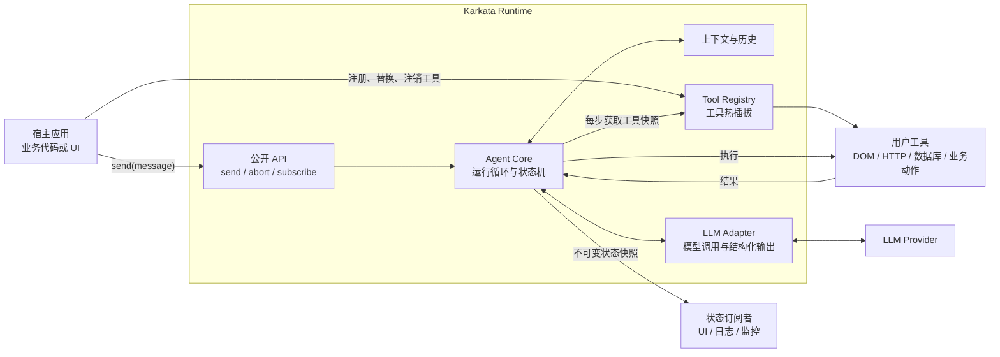
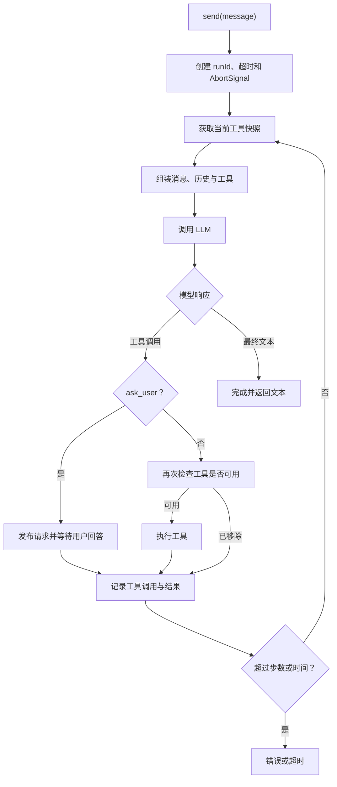
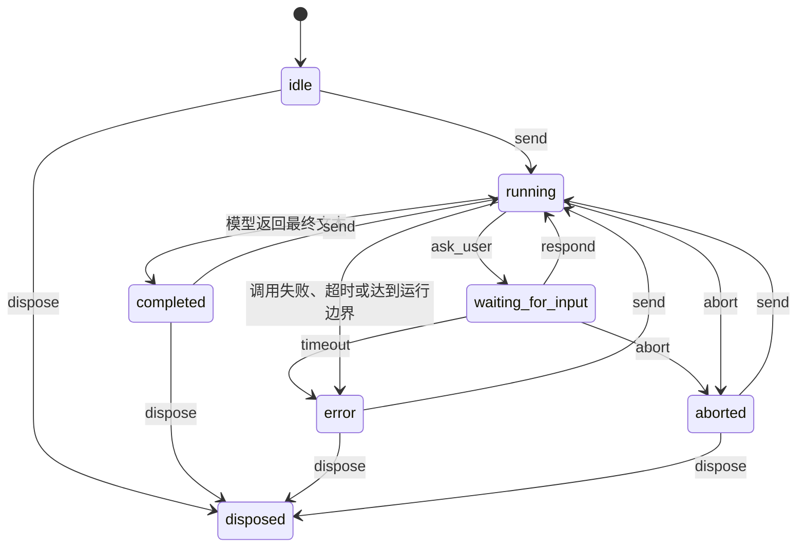
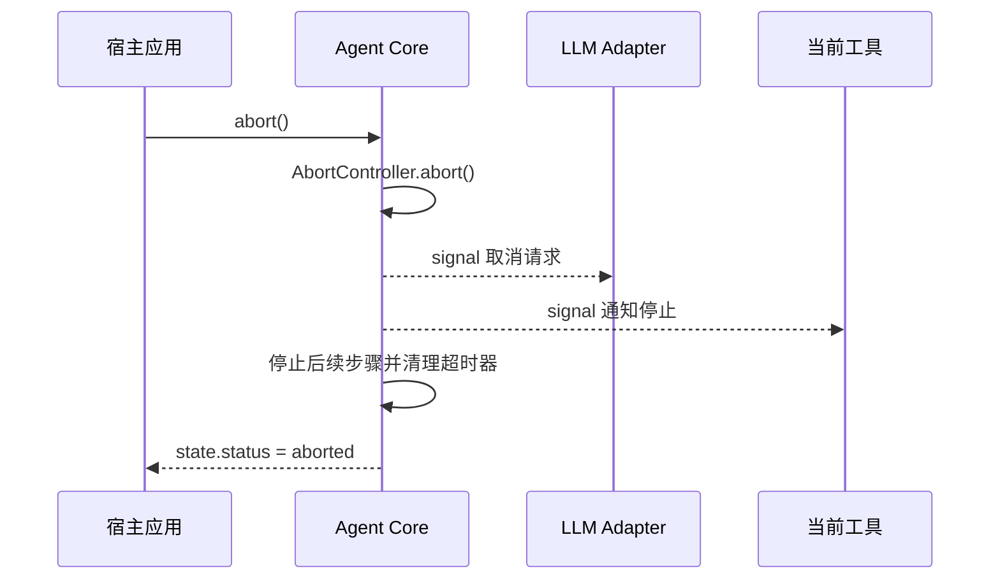
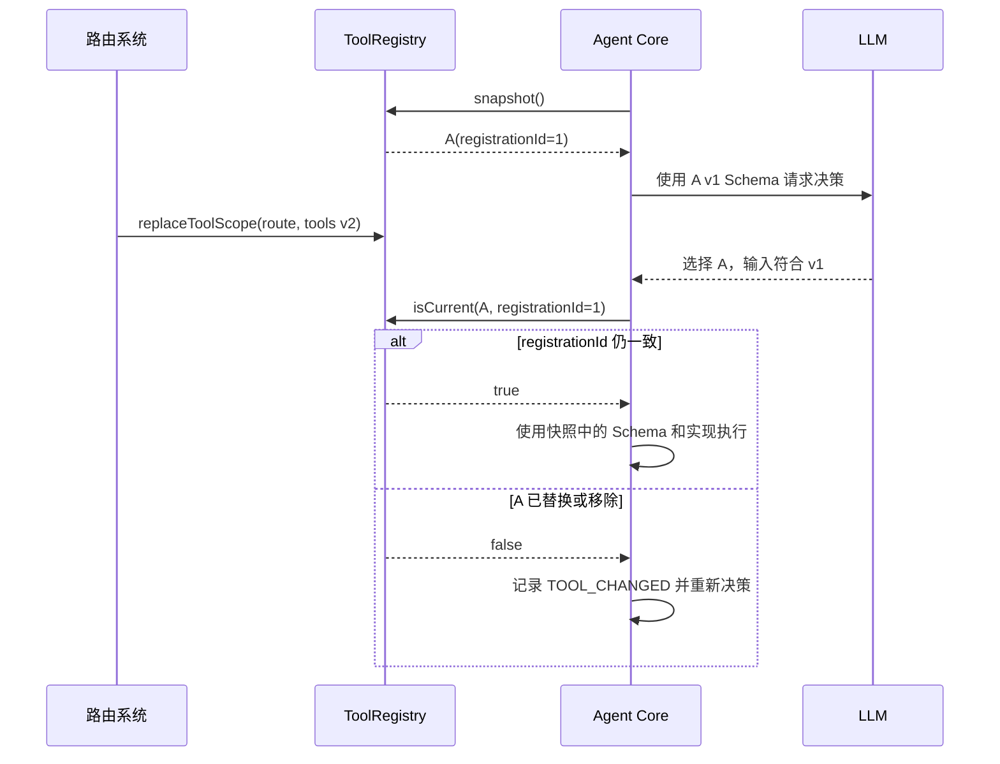

# Karkata 无头智能体运行时设计

## 1. 文档状态

| 属性 | 内容 |
| --- | --- |
| 项目 | Karkata |
| 定位 | 通用 Headless Agent Runtime |
| 阶段 | 首版架构设计 |
| 实现语言 | TypeScript |
| 主要运行环境 | 浏览器，同时避免在 Core 中依赖 DOM |

## 2. 背景与目标

Karkata 参考 Page Agent 的模型适配、Agent 循环和工具调度思路，但不内置页面感知和 DOM 操作能力。

Karkata 的核心是一个无界面、无 DOM 假设、由用户请求触发的 Agent Runtime。它负责管理模型调用、多步任务、工具调度、状态订阅和任务取消；页面操作、数据库访问、HTTP 请求或其他业务能力全部由使用方注册的工具提供。

### 2.1 核心目标

- 提供简洁、稳定的 `new Agent()` 和 `send()` API。
- 适配 OpenAI 兼容的模型与结构化 Tool Calling。
- 支持多步长任务，但对步数、时间和上下文设置边界。
- 支持中断模型请求和正在执行的工具。
- 向宿主应用提供完整的状态快照和订阅能力。
- 支持工具的注册、注销、替换和按作用域热更新。
- Core 不依赖 DOM 和任何前端框架。

### 2.2 非目标

首版不包含：

- 内置 DOM 提取、元素索引、点击、输入或滚动工具。
- Chrome 扩展、跨标签页调度和 MCP Server。
- 与 React、Vue、Angular 或 Svelte 绑定的 UI。
- 多 Agent 协作、并行工具执行和工作流编排。
- 跨页面刷新或跨进程的任务恢复。
- Agent Core 直接执行模型生成的 JavaScript。

## 3. 核心设计原则

### 3.1 请求驱动

Agent 空闲时不主动观察、不轮询环境、不调用模型。只有宿主调用 `send()` 后才启动一次运行。

本设计中的“观察”不指代 Agent 主动读取 DOM，而是指模型获得以下输入：

- 用户消息。
- 会话与任务历史。
- 上一个工具的执行结果。
- 使用方可选注入的上下文。
- 模型主动调用环境感知工具后获得的结果。

### 3.2 能力由工具提供

Agent Core 不知道工具是否在操作 DOM、请求 API 或查询数据库。所有外部能力都使用统一的工具接口注册。

### 3.3 单实例单运行

首版中，一个 Agent 实例同一时间最多运行一个任务。在 `running` 状态再次调用 `send()` 应抛出明确错误。

这项约束避免会话历史、当前工具、取消信号和状态快照产生并发竞争。需要并行任务时，宿主可创建多个 Agent 实例。

### 3.4 状态只读

对外输出的状态是不可变快照。使用方可以读取和渲染，但不能通过修改该对象干扰 Agent 内部运行。

## 4. 总体架构



## 5. 模块划分

```text
src/
├── agent/
│   ├── Agent.ts             # 公开实例与任务循环
│   ├── state.ts             # 状态、状态转换与快照
│   ├── history.ts           # 消息与工具结果历史
│   └── errors.ts            # Agent 领域错误
├── llm/
│   ├── types.ts             # LLMAdapter 契约
│   ├── OpenAICompatibleAdapter.ts # OpenAI 兼容实现
│   └── schema.ts            # Tool Schema 转换与校验
├── tools/
│   ├── ToolRegistry.ts      # 工具注册、替换、作用域
│   └── types.ts             # Tool 和 ToolContext 契约
├── javascript/
│   └── createUnsafeJavaScriptTool.ts
│                              # 可选、显式创建的 JavaScript 工具
├── types.ts                 # 公开配置和返回类型
└── index.ts                 # 统一对外导出
```

### 5.1 LLM 模型适配

职责：

- 将 Agent 消息和工具定义转换为供应商请求。
- 处理 Tool Calling 与最终文本响应。
- 校验响应格式和工具参数。
- 接受 `AbortSignal`。
- 只对可重试错误进行有限重试。

核心契约：

```ts
export interface LLMAdapter {
  invoke(request: LLMRequest, options: { signal: AbortSignal }): Promise<LLMResponse>
  stream?(request: LLMRequest, options: { signal: AbortSignal }): LLMStream
}

export interface LLMResponse {
  message: AssistantMessage
  usage?: TokenUsage
}

export type LLMStreamEvent = {
  readonly type: 'text_delta'
  readonly delta: string
}

export interface LLMStream
  extends AsyncIterable<LLMStreamEvent>, AsyncIterator<LLMStreamEvent, LLMResponse, void> {}
```

`invoke()` 是必需且默认的完整响应路径。显式配置 `streaming: {}` 后，Core 使用可选 `stream()`：iterator 只 yield 非空的规范化文本增量，并以 `done: true` 的完成值返回完整 `LLMResponse`。若产生过文本增量，其累积结果必须与最终 `message.content` 一致；Tool Call 只在最终响应中暴露。内部消息继续使用供应商无关的 `AgentMessage` 协议。每个 Tool Call 包含唯一 `callId`，工具结果通过该 ID 回填。首版对同一响应中的多个 Tool Call 按原顺序执行。详见 [Karkata 消息与会话协议](./Karkata消息与会话协议.md)。

### 5.2 Agent Core

职责：

- 接收用户消息并创建 `runId`。
- 管理状态机、步数、超时和取消。
- 组装会话历史、工具列表与可选上下文。
- 调用 LLM Adapter。
- 调度工具并将结果写回历史。
- 在模型返回最终文本时完成任务。
- 每次状态变更后通知订阅者。

### 5.3 Tool Registry

职责：

- 按名称注册工具。
- 显式替换或注销工具。
- 按作用域整批更新工具。
- 生成当前可用工具的不可变快照。
- 工具真正执行前再次确认它仍然可用。

### 5.4 统一导出

`index.ts` 只导出公开、稳定的 API，不导出内部状态转换函数和供应商响应细节。

```ts
export { Agent } from './agent/Agent'
export { OpenAICompatibleAdapter } from '@karkata/openai-compatible'
export { createUnsafeJavaScriptTool } from './javascript/createUnsafeJavaScriptTool'
export { defineTool } from './tools/types'

export type {
  AgentConfig,
  AgentState,
  AgentResult,
  AgentMessage,
  Tool,
  ToolContext,
  LLMAdapter,
} from './types'
```

## 6. 公开 API 设计

### 6.1 Agent 实例

```ts
import { createAgent } from '@karkata/openai-compatible'

const agent = createAgent({
  model: 'qwen3.5-plus',
  baseURL: 'https://example.com/v1',
  apiKey: '...',
  agent: {
    systemPrompt: '你是业务操作助手。',
    resolveInstructions: async ({ tools, signal }) => {
      return loadModuleInstructions({ tools, signal })
    },
    maxInstructionsLength: 20_000,
    contextBudget: {
      maxTokens: 120_000,
      estimateTokens: (request, { signal }) => estimateModelInputTokens(request, { signal }),
      compaction: {
        triggerTokens: 100_000,
        targetTokens: 70_000,
        compactHistory: (history, context) => compactConversationHistory(history, context),
      },
    },
    humanInput: {},
    maxSteps: 20,
    timeoutMs: 120_000,
    tools: [
      globalTool,
      { tool: auditTool, scope: 'workflow-review' },
    ],
  },
})
```

`@karkata/openai-compatible` 的 `createAgent()` 是 OpenAI-compatible 场景的便捷入口：Provider 配置位于顶层，Runtime 配置位于 `agent`。工厂只组合 `OpenAICompatibleAdapter` 与标准 Core `Agent`。Core 仍只依赖 `LLMAdapter` 契约，不认识默认 Provider；其他协议可实现独立 Adapter，高级使用方也可继续显式调用 `new Agent({ llm: new OpenAICompatibleAdapter(...) })`。

`tools` 用于构造时批量装配固定能力。普通 Tool 默认属于 `global` scope；需要分组管理时使用 `{ tool, scope }`。scope 是任意非空分组键，Core 不解释其业务含义，不与前端路由绑定。初始化批次会先整体校验，任一无效项或重名都会使构造失败。

Core 始终提供不可覆盖的通用默认提示词。`systemPrompt` 是构造时确定的静态应用增强；`resolveInstructions` 是每次调用模型前执行的同步或异步指导函数。Resolver 只返回一段可信字符串，不需要返回 scope 结构；宿主可从传入的当前普通注册工具信息自行判断页面、模块或业务上下文。`ask_user` 等 Runtime 特殊能力由对应配置表达，不伪造用户 scope，也不进入 Resolver 的 Registry 工具投影。

默认提示词、静态增强和动态指导合并为一条临时 system 消息，只进入当次 LLM 请求，不写入会话历史和 `AgentState.messages`，因此 `@karkata/ui` 不会把内部提示词作为对话消息回显。

`contextBudget` 是可选的调用前输入预算。`maxTokens` 由使用方根据模型能力和输出预留确定；`estimateTokens` 接收即将发送给 Adapter 的完整冻结 `LLMRequest` 以及当前 `runId`、`step` 和 `AbortSignal`。Core 不绑定 tokenizer，也不通过 Provider `/models` 猜测上限。

`contextBudget.compaction` 是可选的历史压缩策略。`triggerTokens` 和 `targetTokens` 必须满足 `targetTokens < triggerTokens <= maxTokens`。请求估算超过触发值且存在已提交历史时，Core 把冻结的有效历史交给 `compactHistory`；宿主可删除最旧的完整轮次，或显式调用独立摘要模型返回规范化候选历史。Core 不自动复用主 Adapter，也不假设 Chat Completions 兼容服务具有专有 compaction 端点。由用户会话生成的摘要属于普通会话数据，应保持 user 权限；只有宿主确认可信的内容才可作为 system 消息返回。

建议的公开方法：

```ts
interface Agent {
  readonly state: Readonly<AgentState>

  send(message: string | UserMessage): Promise<AgentResult>
  abort(): void
  clearHistory(): void
  dispose(): Promise<void>

  subscribe(listener: AgentStateListener): () => void
  subscribeRequests(listener: AgentRequestListener): () => void
  respond(requestId: string, answer: string): boolean

  registerTool(tool: Tool, options?: { scope?: string }): () => void
  unregisterTool(name: string, options?: { scope?: string }): boolean
  replaceTool(tool: Tool, options?: { scope?: string }): void
  replaceToolScope(scope: string, tools: Tool[]): void
  listTools(options?: { scope?: string }): readonly RegisteredToolInfo[]
  listToolScopes(): readonly string[]
  removeToolScope(scope: string): number
}
```

`registerTool` 返回一个解注册函数，方便在组件或路由销毁时清理：

```ts
const unregister = agent.registerTool(orderTool, { scope: 'route' })

// 页面卸载时
unregister()
```

### 6.2 `send()` 语义

`send()` 是 Agent 的用户输入通道。它：

1. 检查 Agent 是否可用且当前没有运行中的任务。
2. 创建 `runId` 和任务级 `AbortController`。
3. 追加用户消息。
4. 执行模型与工具循环。
5. 在成功、失败、超时或中断后解析为结构化 `AgentResult`。

同一 Agent 实例默认保留成功运行的会话历史。`clearHistory()` 开启新会话，且在 `running` 状态调用时抛出 `AgentBusyError`。失败或中断运行产生的未提交消息不进入下一次运行。

```ts
type AgentResult =
  | { status: 'completed'; runId: string; content: string; steps: number }
  | { status: 'aborted'; runId: string; steps: number }
  | { status: 'error'; runId: string; error: AgentError; steps: number }
```

运行时错误建议通过 `AgentResult` 表达；参数无效、Agent 已销毁、并发调用 `send()` 等编程错误直接抛出。

### 6.3 工具契约

```ts
interface ToolContext {
  signal: AbortSignal
  runId: string
  step: number
}

type ToolOutput =
  | string
  | number
  | boolean
  | null
  | readonly ToolOutput[]
  | { readonly [key: string]: ToolOutput }

interface Tool<TInput = unknown, TOutput extends ToolOutput = ToolOutput> {
  name: string
  description: string
  inputSchema: Schema<TInput>
  execute(input: TInput, context: ToolContext): Promise<TOutput> | TOutput
}
```

`execute()` 可以定义在任意业务模块，并可通过依赖注入或闭包访问宿主提供的服务。成功执行必须显式返回 `ToolOutput`；纯操作工具返回 `{ success: true }` 等最小确认结果，不需要把底层业务返回值直接提供给模型。`defineTool()` 对推断输出做递归类型校验，拒绝 `void`、`undefined` 和其他明显无效类型，同时接受字段均合法的命名业务 DTO。Runtime 仍负责检测显式类型绕过、非有限数字、非普通对象、symbol 属性、循环引用与长度上限。

工具输出必须可序列化为 JSON 或可安全转换为文本。循环引用、DOM 对象、Response 对象等不应直接返回给 Agent。

## 7. 运行循环



这个循环不需要内置 `done` 工具。模型返回普通 assistant 文本时即表示运行完成；返回 Tool Call 时则继续执行。这比强制使用 MacroTool 更通用，也更接近标准 Tool Calling 协议。

## 8. 状态模型与订阅

### 8.1 状态定义

```ts
type AgentStatus =
  | 'idle'
  | 'running'
  | 'waiting_for_input'
  | 'completed'
  | 'error'
  | 'aborted'
  | 'disposed'

interface AgentState {
  status: AgentStatus
  runId?: string
  step: number
  messages: readonly AgentMessage[]
  activeTool?: {
    name: string
    input: unknown
  }
  result?: AgentResult
  error?: AgentError
  contextUsage?: {
    maxTokens: number
    usedTokens: number
  }
  partialResponse?: {
    runId: string
    step: number
    content: string
  }
  updatedAt: number
}
```

`contextUsage` 只在配置预算时存在，供 UI 直接呈现“当前预计占用 / 最大输入预算”。`usedTokens` 是最近一次模型调用前对完整请求的估算，不是 Provider 返回的累计 usage 或计费统计。构造后初始值为 `0`；每一步预算检查后更新；成功、模型失败或超限后保留最近值；`clearHistory()` 重置为 `0`。状态继续以隔离快照发布。

`partialResponse` 只在启用流式且当前模型步骤已经产生文本时存在。它是按 `runId + step` 标识的累计 UI 投影，不属于 `messages`、会话历史或 `AgentResult`。首个 delta 立即发布，后续采用 leading + trailing 限频；默认间隔为 `32ms`，`0` 表示每个 delta 都发布。完成时最终 AssistantMessage 与 partial 清理在同一状态提交中完成；失败、中断、超时、开始下一模型步骤、`clearHistory()` 和 `dispose()` 也会清理 partial 与尾随定时器。

`waiting_for_input` 仅表示模型已通过 Human-in-the-Loop 特殊工具提出问题并存在未决请求。等待 HTTP、普通工具或模型仍属于 `running`。等待期间仍是同一个活动运行，不能再次 `send()` 或 `clearHistory()`，但可以 `abort()` 或 `dispose()`。

### 8.2 状态机



### 8.3 订阅语义

```ts
const unsubscribe = agent.subscribe((state) => {
  render(state)
})
```

- 订阅时立即同步收到一次当前快照。
- 之后每次状态提交都收到新快照。
- 单个监听器抛错不能中断 Agent 或影响其他监听器。
- 返回的 `unsubscribe` 必须是幂等的。
- `dispose()` 后清空所有监听器。

`send()` 是输入通道，`subscribe()` 是状态输出通道，两者不应混合。

## 9. 长任务设计

首版支持进程内的多步长任务，并设置以下边界：

| 边界 | 作用 | 建议默认值 |
| --- | --- | --- |
| `maxSteps` | 限制 LLM 决策次数 | `20` |
| `timeoutMs` | 限制整次 `send()` 运行时间 | `120000` |
| `maxRetries` | 限制单次模型调用重试 | `2` |
| `maxToolResultLength` | 防止工具结果无限扩大上下文 | 按字符或 token 限制 |
| `contextBudget.maxTokens` | 限制完整模型请求的预计输入 token | 由使用方按模型配置 |
| `contextBudget.compaction.triggerTokens` | 在硬上限前触发历史压缩并保留摘要调用空间 | 小于或等于 `maxTokens` |
| `contextBudget.compaction.targetTokens` | 压缩候选必须达到的完整请求目标 | 小于 `triggerTokens` |
| `streaming.stateUpdateIntervalMs` | 限制累计部分回答的状态发布频率 | `32` |
| `streaming.maxOutputLength` | 限制单个流式模型步骤的累计字符数 | `200000` |

### 9.1 上下文增长

工具结果和步骤历史会让上下文持续增长。每次模型调用前，Runtime 对组装完成的同一冻结请求执行估算；估算结果为非负有限整数且不大于 `maxTokens` 时才调用 Adapter。相等值允许调用，超过上限返回不可重试的 `CONTEXT_LIMIT_EXCEEDED`。估算器异常或非法返回值产生安全的 `CONTEXT_ESTIMATION_ERROR`，不调用模型；两类失败都遵守运行消息原子回滚。

启用压缩后，占用大于 `triggerTokens` 且存在有效历史时，Runtime 在主模型调用前执行 `compactHistory`。回调只接收已成功提交或本运行内已暂存压缩过的历史，不接收当前 `runMessages`、临时 system 指导或工具快照。候选历史必须是结构完整的 `AgentMessage[]`：Assistant 至少有内容或 Tool Call，`callId` 全局唯一，Tool Result 与前序调用一一配对且名称一致，不得留下未完成调用。合法候选与未改动的当前运行消息重新组装完整请求并再次估算；只有占用不大于 `targetTokens` 才继续调用模型。

压缩后的历史属于运行级候选。运行成功时，它与本轮消息一起替换原历史；模型失败、压缩失败、中断或超时时全部丢弃，恢复压缩前历史。回调异常、非法候选或未达到目标统一产生不可重试、固定安全消息的 `CONTEXT_COMPACTION_ERROR`。压缩器可以调用模型生成摘要，但模型、Prompt、重试、凭据、合规和成本均由宿主显式控制。Provider 返回且只能原样回传的不透明 compaction item 不属于当前通用消息契约，需要原生 Adapter 单独设计。

响应中的 `TokenUsage` 是事后 Provider 数据，不写入 `contextUsage`，也不在 Runtime 中累计。估算器可同步或异步执行，并接收当前运行的 `AbortSignal`；即使它忽略信号，取消 Promise 竞争和 runId 门禁仍保证及时收敛与迟到结果隔离。

上下文能力分阶段实现：

1. 当前：限制步数和单个工具结果长度，通过使用方估算器提供完整请求预算，并支持宿主注入的历史裁剪或摘要策略。
2. 后续：按具体 Provider 需求设计原生、不透明上下文项与 Adapter 会话契约。
3. 再后续：增加 checkpoint 和外部存储，实现跨刷新恢复。

### 9.2 长时间工具

工具必须优先使用支持 `AbortSignal` 的 API。如果第三方异步操作忽略取消，Agent 通过取消 Promise 竞争及时停止等待并忽略迟到结果。这保证 Runtime 收敛，但不保证外部副作用真正终止。

## 10. 任务中断



规则：

- `abort()` 在非 `running` 状态调用时为空操作。
- 超时和手动中断复用同一套底层取消机制，但对外结果不同：超时为 `error/TIMEOUT`，手动中断为 `aborted/ABORTED`。
- 取消信号必须传入 LLM Adapter 和 `ToolContext`。
- 工具返回后必须再检查一次 `signal.aborted`。
- 中断不清空会话历史；使用方可以随后调用 `clearHistory()`。

每个 LLM 与工具 Promise 都必须与取消信号竞争，且所有异步续体在提交状态前验证 `runId`。详见 [Karkata 任务取消与超时协议](./Karkata任务取消与超时协议.md)。

流式路径对每次 `iterator.next()` 使用相同的取消竞争和 `runId` 门禁。终止或校验失败时，Runtime best-effort 调用 `iterator.return()`，但不等待清理 Promise；即使 Adapter 忽略信号或清理永不结束，`send()` 仍及时收敛，迟到 delta 不得修改状态或历史。

## 11. 工具热插拔

### 11.1 API

```ts
agent.registerTool(globalTool)
agent.registerTool(orderTool, { scope: 'order-workflow' })

agent.unregisterTool('get_order')
agent.replaceTool(updatedOrderTool, { scope: 'order-workflow' })
agent.replaceToolScope('order-workflow', createOrderWorkflowTools())
```

scope 是通用分组键，可以表示页面、模块、租户、插件、工作流阶段或其他宿主概念。路由切换只是其中一种示例：

```ts
router.afterEach((route) => {
  agent.replaceToolScope('current-context', createToolsForRoute(route))
})
```

### 11.2 语义

- 工具名称在当前有效集合中必须唯一。
- `registerTool` 遇到重名时抛错，避免静默覆盖。
- 覆盖必须显式使用 `replaceTool`。
- `replaceToolScope` 原子替换一个作用域的全部工具。
- `listTools` 返回当前工具的冻结信息快照，只包含名称、描述和 scope，不暴露执行函数、Schema 或注册版本。
- `listToolScopes` 返回所有已创建的 scope，包括当前没有工具的 scope；`global` 在 Agent 构造时创建。
- 注销最后一个工具或调用 `replaceToolScope(scope, [])` 只清空工具，不删除 scope。
- `removeToolScope` 显式删除 scope 及其中全部工具，返回删除的工具数量；`global` 没有特殊保护。
- Agent 在每次 LLM 调用前获取一次工具快照。
- 已经开始执行的工具不因注册表更新被强制中断。
- 每次注册都有唯一 `registrationId`，快照 Schema 和工具实现必须来自同一注册记录。
- 模型返回 Tool Call 后，执行前校验快照中的 `registrationId` 是否仍是当前版本。若已替换或移除，返回 `TOOL_CHANGED` 并重新决策，不将旧 Schema 参数交给新实现。
- 解注册回调绑定 `registrationId`，不会误删后续的同名工具。

完整一致性规则见 [Karkata 工具注册与版本一致性](./Karkata工具注册与版本一致性.md)。

### 11.3 快照一致性



## 12. JavaScript 执行工具

JavaScript 执行应作为一个明确标注为非安全的可选工具工厂提供，而不是 Agent Core 的特权能力。使用方必须显式创建并注册：

```ts
const javascriptTool = createUnsafeJavaScriptTool({
  globals: {
    app: applicationApi,
  },
})

agent.registerTool(javascriptTool)
```

需要明确：在浏览器主页面中使用 `eval` 或 `Function` 不是安全沙箱。它可以访问同一 JavaScript Realm 内的权限，并产生不可预测的副作用。

包只公开 `createUnsafeJavaScriptTool()`，不提供名称较弱的兼容别名。该命名是安全提示，不构成隔离保证；LLM 生成的脚本仍应按不可信代码处理，除非宿主已经通过其他机制建立可信边界。

首版建议：

- 不默认注册。
- 在工具名称和描述中明确风险。
- 接受 `AbortSignal`，但承认纯同步死循环无法被同线程中断。
- 限制返回值长度并处理序列化失败。
- 文档中建议生产环境使用业务专用工具，而不是开放 JavaScript 执行。

真正隔离不可信代码需要 Web Worker、iframe、SES 或服务端沙箱，不属于首版范围。

## 13. 前端框架无关 UI

Core 通过 `send()`、`subscribe()`、`subscribeRequests()`、`respond()` 和 `abort()` 提供 Headless 交互契约。可选的 `@karkata/ui` 包在 Core 之上提供无 DOM 的 `AgentUIStore` 和浏览器 Web Component：

```text
@karkata/core    # Headless Runtime
@karkata/ui      # 框架无关 Store
@karkata/ui/web-component  # 可选 Web Component
```

React、Vue 和原生 UI 通过 `createAgentUIStore(agent)` 订阅 `AgentUIState`，并统一调用 `store.submit(input)`。Store 将 Core 的状态订阅和请求订阅组合成一个 composer：普通状态为 `message`，等待用户输入时为带 `requestId`、`callId` 和问题正文的 `response`。原始 `send()` 在等待回答期间仍未结束，因此 Store 不使用覆盖整个 Promise 的全局提交锁；Core 并发门禁仍保证同一 Agent 最多运行一次。

`AgentState.messages` 是当前模型上下文快照：成功的历史压缩可以替换旧消息，失败或中止会回滚本轮消息。它不是追加式 UI 历史。`AgentUIStore` 从绑定时开始维护独立的会话期展示记录，保留已观察到但从模型上下文消失的交互；绑定时已有的非空内容只能标记为 `context_snapshot`、`runStatus: 'unknown'` 和 `historyCompleteness: 'context_only'`，不能冒充完整 transcript。`clearHistory()` 是显式清空边界，Store items 也不是 checkpoint 或持久化格式。

启用流式后，Store 将匹配当前 `runId + step` 的 `partialResponse` 投影为稳定 ID 的普通 Assistant item，并以 `contentStatus: streaming` 原位更新。完整消息到达时转为 `complete`；失败、中止或 dispose 时保留已显示内容并转为 `incomplete`。该状态与 `runStatus` 独立，不反向写入 Core。默认 Web Component 继续使用 keyed DOM 和近底滚动保护，自定义 React/Vue UI 可直接按 `contentStatus` 判断，无需读取或拼接 Core partial。

Human-in-the-Loop 问题和被接受的回答在 Store 中表现为普通 Assistant/用户消息，并以 `source: 'human_input'` 保留来源。其他 Tool Call/Result 只公开 `name`、`callId` 和状态，不公开原始输入或结果。详细契约见 [Karkata UI 交互契约](./Karkata%20UI%20交互契约.md)。

Web Component 显式注册且导入阶段不访问 DOM：

```ts
import { defineKarkataPanel } from '@karkata/ui/web-component'

defineKarkataPanel()
const panel = document.querySelector('karkata-panel')
panel.agent = agent
```

`panel.agent` 由面板创建并持有 Store，元素断开时释放它。需要跨挂载保留展示记录时，宿主应创建外部 Store 并设置 `panel.store = store`，同时负责最终 `store.dispose()`。

### 13.1 等待用户输入

配置 `humanInput: {}` 后，Runtime 在每一步模型请求中注入固定的 `ask_user` 特殊工具。模型调用它时，Agent 发布独立请求并暂停同一次 `send()`：

```ts
const unsubscribe = agent.subscribeRequests((request) => {
  showQuestion(request.prompt).then((answer) => {
    agent.respond(request.id, answer)
  })
})
```

请求是冻结的 `{ type: 'human_input', id, callId, runId, step, prompt }` 快照。`id` 标识一次只能回答一次的宿主请求，`callId` 关联模型发出的原 `ask_user` Tool Call；`respond()` 仍使用请求 `id`。晚订阅者会立即收到当前未决请求；监听器异常彼此隔离。`respond()` 只接受当前 ID 的非空字符串一次，有效回答成为原 Tool Call 的成功 Tool Result，并受 `maxToolResultLength` 限制。错误 ID、重复或终止后的迟到回答返回 `false`，不会恢复旧运行。

`ask_user` 仅在显式启用时为保留名称，不进入普通 Tool Registry、scope 或 `listTools()`。首版不提供结构化表单或独立请求超时，等待受整次运行的 `timeoutMs`、`abort()` 和 `dispose()` 控制。模型主动询问不是安全边界；敏感工具仍需由宿主执行强制授权。

## 14. 完整使用示例

```ts
import { Agent, defineTool } from '@karkata/core'
import { OpenAICompatibleAdapter } from '@karkata/openai-compatible'
import { z } from 'zod'

const agent = new Agent({
  llm: new OpenAICompatibleAdapter({
    model: 'qwen3.5-plus',
    baseURL: 'https://example.com/v1',
    apiKey: '...',
  }),
  systemPrompt: '你是订单处理助手。',
  maxSteps: 20,
  timeoutMs: 120_000,
})

const getPageContext = defineTool({
  name: 'get_page_context',
  description: '读取当前页面的订单信息',
  inputSchema: z.object({}),
  execute: async (_, { signal }) => {
    signal.throwIfAborted()
    return readOrderPage()
  },
})

const submitOrder = defineTool({
  name: 'submit_order',
  description: '提交指定订单',
  inputSchema: z.object({
    orderId: z.string(),
  }),
  execute: async ({ orderId }, { signal }) => {
    return submitOrderById(orderId, signal)
  },
})

agent.registerTool(getPageContext, { scope: 'route' })
agent.registerTool(submitOrder, { scope: 'route' })

const unsubscribe = agent.subscribe((state) => {
  updateApplicationUI(state)
})

const result = await agent.send('检查并提交当前订单')

unsubscribe()
```

## 15. 错误分类

```ts
type AgentErrorCode =
  | 'MODEL_NETWORK_ERROR'
  | 'MODEL_AUTH_ERROR'
  | 'MODEL_RATE_LIMIT'
  | 'MODEL_INVALID_RESPONSE'
  | 'MODEL_PROVIDER_ERROR'
  | 'MODEL_ERROR'
  | 'TOOL_NOT_FOUND'
  | 'TOOL_CHANGED'
  | 'TOOL_INVALID_INPUT'
  | 'TOOL_EXECUTION_ERROR'
  | 'MAX_STEPS_EXCEEDED'
  | 'TIMEOUT'
  | 'ABORTED'
  | 'CONTEXT_LIMIT_EXCEEDED'
  | 'CONTEXT_ESTIMATION_ERROR'
  | 'INTERNAL_ERROR'
```

每个 `AgentError` 包含 `code`、已脱敏的 `message`、必填 `retryable` 与可选有限整数 `statusCode`。原始 `cause`、API Key、Authorization Header、请求体、响应正文和未脱敏的供应商数据不得进入 `AgentResult` 或 `AgentState`。

Adapter 通过 Core 导出的 Provider 无关 `ModelError` 报告标准化模型故障：

```ts
new ModelError({
  code: 'MODEL_RATE_LIMIT',
  message: 'Model rate limit exceeded with HTTP 429',
  retryable: true,
  statusCode: 429,
  cause: providerError,
})
```

`cause` 只保留在抛出的 `ModelError` 上供 Adapter 调用栈诊断，Core 复制到公开错误时将其删除。未采用该契约的第三方 Adapter 异常映射为不可重试的 `MODEL_ERROR`。取消 signal 已触发时 AbortError 直接穿透分类；Runtime 仍以手动中断或超时作为最终结果。

OpenAI-compatible Adapter 使用以下规则：网络失败、HTTP 429 和 HTTP 5xx 可重试；401/403、其他 4xx、响应 JSON/Schema/Tool Call 参数无效以及宿主 Header/请求转换回调失败不可重试。非成功 HTTP 响应正文不进入错误消息。流式请求使用标准 SSE parser 处理跨网络 chunk 的 event，并在最终组装 Tool Call 参数。建连和 HTTP 错误沿用上述重试；成功响应体一旦开始消费就不自动重发，避免重复发布文本。`finish_reason` 后仍继续读取 usage，优先等待 `[DONE]`；兼容性 EOF 只有在已看到合法 `finish_reason` 时才接受。

## 16. 建议实现阶段

### 阶段一：最小运行时

- `LLMAdapter` 契约和 `OpenAICompatibleAdapter`。
- `Tool`、`defineTool` 和 `ToolRegistry`。
- `Agent.send()` 的文本 / Tool Call 循环。
- `maxSteps`、`timeoutMs` 和 `abort()`。
- `AgentState` 和 `subscribe()`。
- 规范化 `AgentMessage`、Tool Call ID 与默认持续会话。
- 工具 `registrationId` 和快照版本校验。
- 取消 Promise 竞争、`runId` 门禁与迟到结果隔离。
- 工具结果序列化、长度限制和截断标记。
- 核心单元测试。

### 阶段二：动态能力

- 工具作用域和 `replaceToolScope()`。
- 可选 `createUnsafeJavaScriptTool()`。
- 完整请求 token 预算、超限保护与最小 UI 占用状态。
- 模型错误分类、重试元数据与安全 HTTP 调试信息。

### 阶段三：生态能力

- 已完成：宿主注入的历史摘要与裁剪策略。
- 已完成：Human-in-the-Loop 用户输入协议。
- 已完成：框架无关 Store 与基于 Web Component 的可选 `@karkata/ui`。
- 已完成：Core 与 OpenAI-compatible 的流式回答基础。
- 已完成：`@karkata/ui` 的增量 Assistant 消息投影。
- 后续：checkpoint 与可插拔持久化。
- 按需：原生 Provider 不透明 compaction item 适配。

## 17. 待后续确定的决策

以下问题不阻塞阶段一，但实现对应能力前需要单独决策：

- 公开 Schema 类型是绑定 Zod，还是定义更通用的 Standard Schema 契约。
- checkpoint 的版本、恢复校验与外部存储接口。
- 是否为特定 Provider 增加不透明 compaction item 适配。

## 18. 结论

Karkata 的核心边界是：

> Agent Core 只管理用户消息、模型决策、工具循环、运行状态和取消；环境感知与副作用全部属于用户注册的工具。

这个边界使 Karkata 既能用于网页操作，也能用于 API 编排、数据查询、业务 Copilot 和其他工具驱动的 Agent 场景，同时保持核心运行时轻量且可测试。
