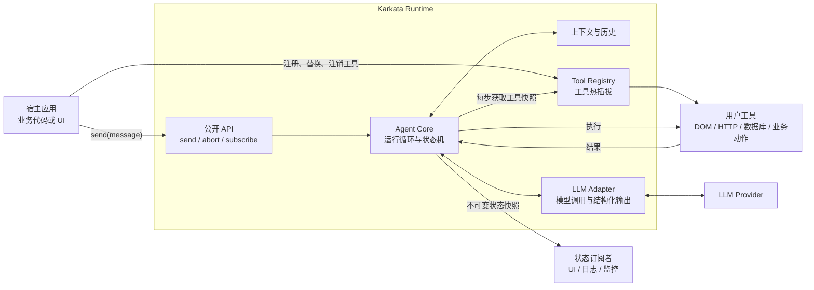
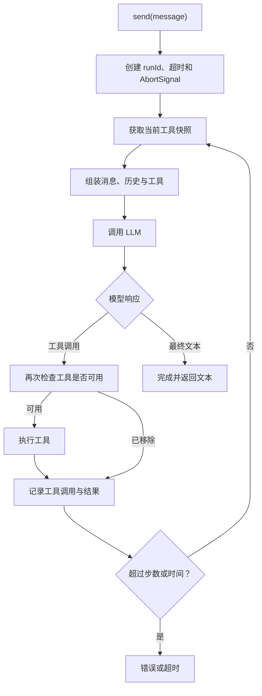
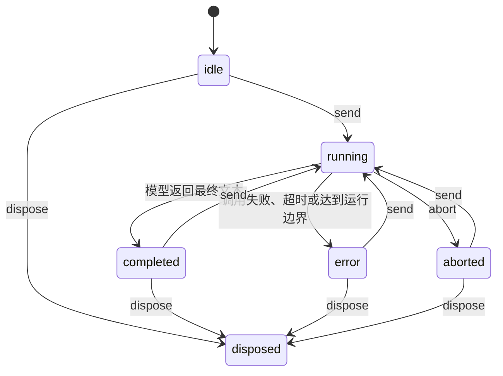
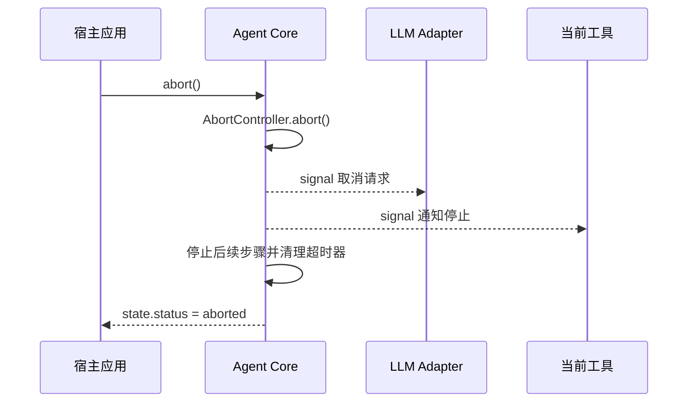
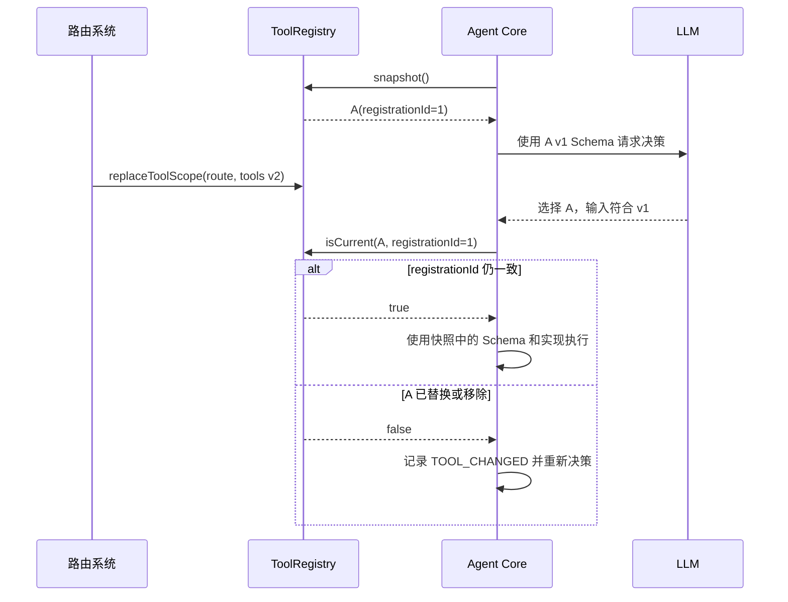

# Karkata 无头智能体运行时设计

## 1. 文档状态

| 属性 | 内容 |
| --- | --- |
| 项目 | Karkata |
| 定位 | 通用 Headless Agent Runtime |
| 阶段 | 首版架构设计 |
| 实现语言 | TypeScript |
| 主要运行环境 | 浏览器，同时避免在 Core 中依赖 DOM |

## 2. 背景与目标

Karkata 参考 Page Agent 的模型适配、Agent 循环和工具调度思路，但不内置页面感知和 DOM 操作能力。

Karkata 的核心是一个无界面、无 DOM 假设、由用户请求触发的 Agent Runtime。它负责管理模型调用、多步任务、工具调度、状态订阅和任务取消；页面操作、数据库访问、HTTP 请求或其他业务能力全部由使用方注册的工具提供。

### 2.1 核心目标

- 提供简洁、稳定的 `new Agent()` 和 `send()` API。
- 适配 OpenAI 兼容的模型与结构化 Tool Calling。
- 支持多步长任务，但对步数、时间和上下文设置边界。
- 支持中断模型请求和正在执行的工具。
- 向宿主应用提供完整的状态快照和订阅能力。
- 支持工具的注册、注销、替换和按作用域热更新。
- Core 不依赖 DOM 和任何前端框架。

### 2.2 非目标

首版不包含：

- 内置 DOM 提取、元素索引、点击、输入或滚动工具。
- Chrome 扩展、跨标签页调度和 MCP Server。
- 与 React、Vue、Angular 或 Svelte 绑定的 UI。
- 多 Agent 协作、并行工具执行和工作流编排。
- 跨页面刷新或跨进程的任务恢复。
- Agent Core 直接执行模型生成的 JavaScript。

## 3. 核心设计原则

### 3.1 请求驱动

Agent 空闲时不主动观察、不轮询环境、不调用模型。只有宿主调用 `send()` 后才启动一次运行。

本设计中的“观察”不指代 Agent 主动读取 DOM，而是指模型获得以下输入：

- 用户消息。
- 会话与任务历史。
- 上一个工具的执行结果。
- 使用方可选注入的上下文。
- 模型主动调用环境感知工具后获得的结果。

### 3.2 能力由工具提供

Agent Core 不知道工具是否在操作 DOM、请求 API 或查询数据库。所有外部能力都使用统一的工具接口注册。

### 3.3 单实例单运行

首版中，一个 Agent 实例同一时间最多运行一个任务。在 `running` 状态再次调用 `send()` 应抛出明确错误。

这项约束避免会话历史、当前工具、取消信号和状态快照产生并发竞争。需要并行任务时，宿主可创建多个 Agent 实例。

### 3.4 状态只读

对外输出的状态是不可变快照。使用方可以读取和渲染，但不能通过修改该对象干扰 Agent 内部运行。

## 4. 总体架构



## 5. 模块划分

```text
src/
├── agent/
│   ├── Agent.ts             # 公开实例与任务循环
│   ├── state.ts             # 状态、状态转换与快照
│   ├── history.ts           # 消息与工具结果历史
│   └── errors.ts            # Agent 领域错误
├── llm/
│   ├── types.ts             # LLMAdapter 契约
│   ├── OpenAIAdapter.ts     # OpenAI 兼容实现
│   └── schema.ts            # Tool Schema 转换与校验
├── tools/
│   ├── ToolRegistry.ts      # 工具注册、替换、作用域
│   └── types.ts             # Tool 和 ToolContext 契约
├── javascript/
│   └── createJavaScriptTool.ts
│                              # 可选、显式创建的 JavaScript 工具
├── types.ts                 # 公开配置和返回类型
└── index.ts                 # 统一对外导出
```

### 5.1 LLM 模型适配

职责：

- 将 Agent 消息和工具定义转换为供应商请求。
- 处理 Tool Calling 与最终文本响应。
- 校验响应格式和工具参数。
- 接受 `AbortSignal`。
- 只对可重试错误进行有限重试。

核心契约：

```ts
export interface LLMAdapter {
  invoke(request: LLMRequest, options: { signal: AbortSignal }): Promise<LLMResponse>
}

export interface LLMResponse {
  message: AssistantMessage
  usage?: TokenUsage
}
```

内部消息使用供应商无关的 `AgentMessage` 协议。每个 Tool Call 包含唯一 `callId`，工具结果通过该 ID 回填。首版对同一响应中的多个 Tool Call 按原顺序执行。详见 [Karkata 消息与会话协议](./Karkata消息与会话协议.md)。

### 5.2 Agent Core

职责：

- 接收用户消息并创建 `runId`。
- 管理状态机、步数、超时和取消。
- 组装会话历史、工具列表与可选上下文。
- 调用 LLM Adapter。
- 调度工具并将结果写回历史。
- 在模型返回最终文本时完成任务。
- 每次状态变更后通知订阅者。

### 5.3 Tool Registry

职责：

- 按名称注册工具。
- 显式替换或注销工具。
- 按作用域整批更新工具。
- 生成当前可用工具的不可变快照。
- 工具真正执行前再次确认它仍然可用。

### 5.4 统一导出

`index.ts` 只导出公开、稳定的 API，不导出内部状态转换函数和供应商响应细节。

```ts
export { Agent } from './agent/Agent'
export { OpenAIAdapter } from './llm/OpenAIAdapter'
export { createJavaScriptTool } from './javascript/createJavaScriptTool'
export { defineTool } from './tools/types'

export type {
  AgentConfig,
  AgentState,
  AgentResult,
  AgentMessage,
  Tool,
  ToolContext,
  LLMAdapter,
} from './types'
```

## 6. 公开 API 设计

### 6.1 Agent 实例

```ts
const agent = new Agent({
  llm: new OpenAIAdapter({
    model: 'qwen3.5-plus',
    baseURL: 'https://example.com/v1',
    apiKey: '...',
  }),
  systemPrompt: '你是业务操作助手。',
  maxSteps: 20,
  timeoutMs: 120_000,
})
```

建议的公开方法：

```ts
interface Agent {
  readonly state: Readonly<AgentState>

  send(message: string | UserMessage): Promise<AgentResult>
  abort(): void
  clearHistory(): void
  dispose(): Promise<void>

  subscribe(listener: AgentStateListener): () => void

  registerTool(tool: Tool, options?: { scope?: string }): () => void
  unregisterTool(name: string, options?: { scope?: string }): boolean
  replaceTool(tool: Tool, options?: { scope?: string }): void
  replaceToolScope(scope: string, tools: Tool[]): void
}
```

`registerTool` 返回一个解注册函数，方便在组件或路由销毁时清理：

```ts
const unregister = agent.registerTool(orderTool, { scope: 'route' })

// 页面卸载时
unregister()
```

### 6.2 `send()` 语义

`send()` 是 Agent 的用户输入通道。它：

1. 检查 Agent 是否可用且当前没有运行中的任务。
2. 创建 `runId` 和任务级 `AbortController`。
3. 追加用户消息。
4. 执行模型与工具循环。
5. 在成功、失败、超时或中断后解析为结构化 `AgentResult`。

同一 Agent 实例默认保留成功运行的会话历史。`clearHistory()` 开启新会话，且在 `running` 状态调用时抛出 `AgentBusyError`。失败或中断运行产生的未提交消息不进入下一次运行。

```ts
type AgentResult =
  | { status: 'completed'; runId: string; content: string; steps: number }
  | { status: 'aborted'; runId: string; steps: number }
  | { status: 'error'; runId: string; error: AgentError; steps: number }
```

运行时错误建议通过 `AgentResult` 表达；参数无效、Agent 已销毁、并发调用 `send()` 等编程错误直接抛出。

### 6.3 工具契约

```ts
interface ToolContext {
  signal: AbortSignal
  runId: string
  step: number
}

interface Tool<TInput = unknown, TOutput = unknown> {
  name: string
  description: string
  inputSchema: Schema<TInput>
  execute(input: TInput, context: ToolContext): Promise<TOutput> | TOutput
}
```

工具输出必须可序列化为 JSON 或可安全转换为文本。循环引用、DOM 对象、Response 对象等不应直接返回给 Agent。

## 7. 运行循环



这个循环不需要内置 `done` 工具。模型返回普通 assistant 文本时即表示运行完成；返回 Tool Call 时则继续执行。这比强制使用 MacroTool 更通用，也更接近标准 Tool Calling 协议。

## 8. 状态模型与订阅

### 8.1 状态定义

```ts
type AgentStatus =
  | 'idle'
  | 'running'
  | 'completed'
  | 'error'
  | 'aborted'
  | 'disposed'

interface AgentState {
  status: AgentStatus
  runId?: string
  step: number
  messages: readonly AgentMessage[]
  activeTool?: {
    name: string
    input: unknown
  }
  result?: AgentResult
  error?: AgentError
  updatedAt: number
}
```

`waiting` 暂不作为首版状态。等待 HTTP、工具或模型都属于 `running`，具体阶段通过 `activeTool` 或后续的活动事件表达。只有引入“等待用户回答”协议后，才需要增加 `waiting_for_input`。

### 8.2 状态机



### 8.3 订阅语义

```ts
const unsubscribe = agent.subscribe((state) => {
  render(state)
})
```

- 订阅时立即同步收到一次当前快照。
- 之后每次状态提交都收到新快照。
- 单个监听器抛错不能中断 Agent 或影响其他监听器。
- 返回的 `unsubscribe` 必须是幂等的。
- `dispose()` 后清空所有监听器。

`send()` 是输入通道，`subscribe()` 是状态输出通道，两者不应混合。

## 9. 长任务设计

首版支持进程内的多步长任务，并设置以下边界：

| 边界 | 作用 | 建议默认值 |
| --- | --- | --- |
| `maxSteps` | 限制 LLM 决策次数 | `20` |
| `timeoutMs` | 限制整次 `send()` 运行时间 | `120000` |
| `maxRetries` | 限制单次模型调用重试 | `2` |
| `maxToolResultLength` | 防止工具结果无限扩大上下文 | 按字符或 token 限制 |

### 9.1 上下文增长

工具结果和步骤历史会让上下文持续增长。建议分阶段实现：

1. 首版：限制步数和单个工具结果长度，在接近模型上下文上限时返回明确错误。
2. 后续：引入历史裁剪和摘要策略，但将策略定义为可替换接口。
3. 再后续：增加 checkpoint 和外部存储，实现跨刷新恢复。

### 9.2 长时间工具

工具必须优先使用支持 `AbortSignal` 的 API。如果第三方异步操作忽略取消，Agent 通过取消 Promise 竞争及时停止等待并忽略迟到结果。这保证 Runtime 收敛，但不保证外部副作用真正终止。

## 10. 任务中断



规则：

- `abort()` 在非 `running` 状态调用时为空操作。
- 超时和手动中断复用同一套底层取消机制，但对外结果不同：超时为 `error/TIMEOUT`，手动中断为 `aborted/ABORTED`。
- 取消信号必须传入 LLM Adapter 和 `ToolContext`。
- 工具返回后必须再检查一次 `signal.aborted`。
- 中断不清空会话历史；使用方可以随后调用 `clearHistory()`。

每个 LLM 与工具 Promise 都必须与取消信号竞争，且所有异步续体在提交状态前验证 `runId`。详见 [Karkata 任务取消与超时协议](./Karkata任务取消与超时协议.md)。

## 11. 工具热插拔

### 11.1 API

```ts
agent.registerTool(globalTool)
agent.registerTool(orderTool, { scope: 'route' })

agent.unregisterTool('get_order')
agent.replaceTool(updatedOrderTool, { scope: 'route' })
agent.replaceToolScope('route', createToolsForRoute(route))
```

路由切换示例：

```ts
router.afterEach((route) => {
  agent.replaceToolScope('route', createToolsForRoute(route))
})
```

### 11.2 语义

- 工具名称在当前有效集合中必须唯一。
- `registerTool` 遇到重名时抛错，避免静默覆盖。
- 覆盖必须显式使用 `replaceTool`。
- `replaceToolScope` 原子替换一个作用域的全部工具。
- Agent 在每次 LLM 调用前获取一次工具快照。
- 已经开始执行的工具不因注册表更新被强制中断。
- 每次注册都有唯一 `registrationId`，快照 Schema 和工具实现必须来自同一注册记录。
- 模型返回 Tool Call 后，执行前校验快照中的 `registrationId` 是否仍是当前版本。若已替换或移除，返回 `TOOL_CHANGED` 并重新决策，不将旧 Schema 参数交给新实现。
- 解注册回调绑定 `registrationId`，不会误删后续的同名工具。

完整一致性规则见 [Karkata 工具注册与版本一致性](./Karkata工具注册与版本一致性.md)。

### 11.3 快照一致性



## 12. JavaScript 执行工具

JavaScript 执行应作为一个可选工具工厂提供，而不是 Agent Core 的特权能力。使用方必须显式创建并注册：

```ts
const javascriptTool = createJavaScriptTool({
  globals: {
    app: applicationApi,
  },
})

agent.registerTool(javascriptTool)
```

需要明确：在浏览器主页面中使用 `eval` 或 `Function` 不是安全沙箱。它可以访问同一 JavaScript Realm 内的权限，并产生不可预测的副作用。

首版建议：

- 不默认注册。
- 在工具名称和描述中明确风险。
- 接受 `AbortSignal`，但承认纯同步死循环无法被同线程中断。
- 限制返回值长度并处理序列化失败。
- 文档中建议生产环境使用业务专用工具，而不是开放 JavaScript 执行。

真正隔离不可信代码需要 Web Worker、iframe、SES 或服务端沙箱，不属于首版范围。

## 13. 前端框架无关 UI

Core 首先通过 `send()`、`subscribe()` 和 `abort()` 提供框架无关的交互契约。React、Vue 或原生页面都可直接基于该契约构建 UI。

可选通用 UI 应当作为独立包在后续实现：

```text
@karkata/core    # Headless Runtime
@karkata/ui      # 可选 Web Component
```

Web Component 只依赖 Agent 的公开契约：

```ts
const panel = document.querySelector('karkata-panel')
panel.agent = agent
```

首版不实现 UI，但需要保证状态快照包含渲染通用 UI 所需的信息。

### 13.1 等待用户输入

状态订阅不能同时承担用户回答通道。若后续需要 Agent 在任务中追问用户，应增加独立协议：

```ts
agent.subscribeRequests((request) => {
  showQuestion(request)
})

agent.respond(request.id, answer)
```

该能力会引入 `waiting_for_input` 状态、请求超时和取消语义，因此列入后续版本。

## 14. 完整使用示例

```ts
import { Agent, OpenAIAdapter, defineTool } from 'karkata'
import { z } from 'zod'

const agent = new Agent({
  llm: new OpenAIAdapter({
    model: 'qwen3.5-plus',
    baseURL: 'https://example.com/v1',
    apiKey: '...',
  }),
  systemPrompt: '你是订单处理助手。',
  maxSteps: 20,
  timeoutMs: 120_000,
})

const getPageContext = defineTool({
  name: 'get_page_context',
  description: '读取当前页面的订单信息',
  inputSchema: z.object({}),
  execute: async (_, { signal }) => {
    signal.throwIfAborted()
    return readOrderPage()
  },
})

const submitOrder = defineTool({
  name: 'submit_order',
  description: '提交指定订单',
  inputSchema: z.object({
    orderId: z.string(),
  }),
  execute: async ({ orderId }, { signal }) => {
    return submitOrderById(orderId, signal)
  },
})

agent.registerTool(getPageContext, { scope: 'route' })
agent.registerTool(submitOrder, { scope: 'route' })

const unsubscribe = agent.subscribe((state) => {
  updateApplicationUI(state)
})

const result = await agent.send('检查并提交当前订单')

unsubscribe()
```

## 15. 错误分类

```ts
type AgentErrorCode =
  | 'MODEL_NETWORK_ERROR'
  | 'MODEL_AUTH_ERROR'
  | 'MODEL_RATE_LIMIT'
  | 'MODEL_INVALID_RESPONSE'
  | 'TOOL_NOT_FOUND'
  | 'TOOL_CHANGED'
  | 'TOOL_INVALID_INPUT'
  | 'TOOL_EXECUTION_ERROR'
  | 'MAX_STEPS_EXCEEDED'
  | 'TIMEOUT'
  | 'ABORTED'
  | 'CONTEXT_LIMIT_EXCEEDED'
  | 'INTERNAL_ERROR'
```

每个 `AgentError` 应包含 `code`、`message`、可选 `cause` 与是否可重试的标记。API Key、Authorization Header 和未脱敏的供应商请求不得进入状态快照。

## 16. 建议实现阶段

### 阶段一：最小运行时

- `LLMAdapter` 契约和 `OpenAIAdapter`。
- `Tool`、`defineTool` 和 `ToolRegistry`。
- `Agent.send()` 的文本 / Tool Call 循环。
- `maxSteps`、`timeoutMs` 和 `abort()`。
- `AgentState` 和 `subscribe()`。
- 规范化 `AgentMessage`、Tool Call ID 与默认持续会话。
- 工具 `registrationId` 和快照版本校验。
- 取消 Promise 竞争、`runId` 门禁与迟到结果隔离。
- 工具结果序列化、长度限制和截断标记。
- 核心单元测试。

### 阶段二：动态能力

- 工具作用域和 `replaceToolScope()`。
- 可选 `createJavaScriptTool()`。
- 更完整的 token 上下文预算。
- 更完整的错误分类与调试信息。

### 阶段三：生态能力

- 历史摘要策略。
- 等待用户输入协议。
- 基于 Web Component 的可选 `@karkata/ui`。
- checkpoint 与可插拔持久化。

## 17. 待后续确定的决策

以下问题不阻塞阶段一，但实现对应能力前需要单独决策：

- 公开 Schema 类型是绑定 Zod，还是定义更通用的 Standard Schema 契约。
- 状态快照是否包含完整历史，或只包含渲染所需的消息投影。
- JavaScript 工具的首个版本是否与 Core 同时发布。

## 18. 结论

Karkata 的核心边界是：

> Agent Core 只管理用户消息、模型决策、工具循环、运行状态和取消；环境感知与副作用全部属于用户注册的工具。

这个边界使 Karkata 既能用于网页操作，也能用于 API 编排、数据查询、业务 Copilot 和其他工具驱动的 Agent 场景，同时保持核心运行时轻量且可测试。
