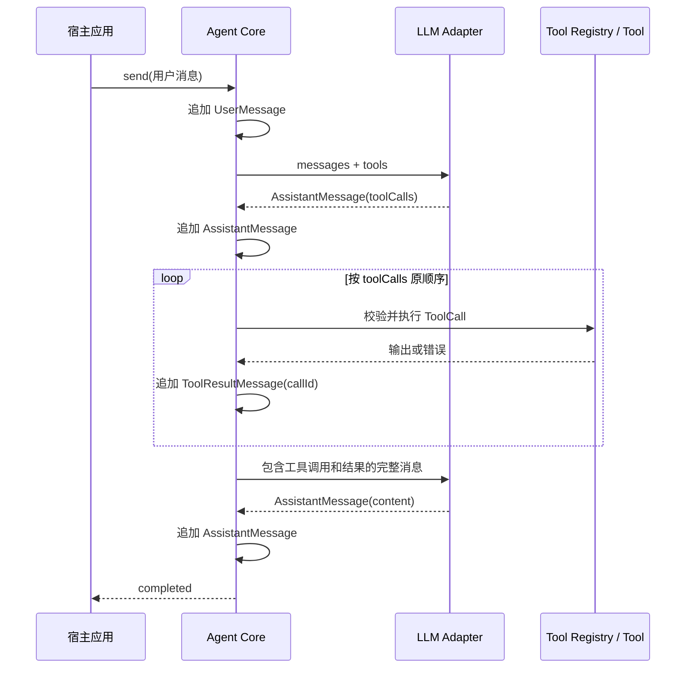

# Karkata 消息与会话协议

## 1. 目的

本文定义 Karkata Core 内部使用的供应商无关消息协议，以及同一 `Agent` 实例中多次 `send()` 的会话语义。

该协议解决以下问题：

- Tool Call 和工具结果如何稳定关联。
- 多个 Tool Call 如何按顺序执行并回填结果。
- LLM Adapter 与 Agent Core 的标准化边界。
- 同一 Agent 实例是否自动保留会话。
- 中断或失败后哪些消息可以留在历史中。

## 2. 首版决策

1. 同一 `Agent` 实例默认是一个持续会话。
2. 每次 `send()` 追加一条 `user` 消息，并在成功完成时保留本轮全部规范化消息。
3. `clearHistory()` 显式开启一个新会话，仅允许在非 `running` 状态调用。
4. Agent Core 只处理本文定义的 `AgentMessage`；供应商原始响应不进入会话历史。
5. 每个 Tool Call 必须有唯一 `callId`，每个工具结果必须通过该 ID 关联到原调用。
6. 同一模型响应中的多个 Tool Call 按原顺序执行，不并行。

## 3. 规范化消息模型

```ts
export type AgentMessage =
  | SystemMessage
  | UserMessage
  | AssistantMessage
  | ToolResultMessage

export interface SystemMessage {
  role: 'system'
  content: string
}

export interface UserMessage {
  role: 'user'
  content: string
}

export interface AssistantMessage {
  role: 'assistant'
  content: string | null
  toolCalls?: readonly ToolCall[]
}

export interface ToolCall {
  callId: string
  name: string
  input: unknown
}

export interface ToolResultMessage {
  role: 'tool'
  callId: string
  name: string
  content: string
  isError: boolean
}
```

### 3.1 不变式

- `AssistantMessage` 必须至少包含非空 `content` 或一个 `toolCalls`。
- 同一会话中 `callId` 不得重复。
- `ToolResultMessage.callId` 必须指向前面某条 assistant 消息中的 Tool Call。
- 每个 Tool Call 必须且只能有一条最终工具结果。
- `ToolResultMessage.name` 必须与 Tool Call 中的名称一致。
- 工具结果统一序列化为文本，不向 Adapter 暴露 DOM、`Response` 或循环对象。

## 4. LLM Adapter 边界

```ts
export interface LLMRequest {
  messages: readonly AgentMessage[]
  tools: readonly LLMToolDefinition[]
}

export interface LLMResponse {
  message: AssistantMessage
  usage?: TokenUsage
}

export interface LLMAdapter {
  invoke(
    request: LLMRequest,
    options: { signal: AbortSignal },
  ): Promise<LLMResponse>
}
```

Adapter 负责：

- 将 `AgentMessage` 转换为供应商消息格式。
- 将供应商 Tool Call ID 映射为 `callId`。
- 将模型输出归一化为一条 `AssistantMessage`。
- 在供应商未返回 Tool Call ID 时生成当前会话内唯一的 ID。
- 保存 Tool Call 顺序。
- 校验基本响应形状，不执行工具。

Agent Core 负责：

- 使用快照中的 Schema 校验 `ToolCall.input`。
- 执行工具。
- 生成 `ToolResultMessage`。
- 维护消息顺序和会话不变式。

### 4.1 临时 System Message

每次调用 LLM 前，Core 将内置默认提示词、静态 `systemPrompt` 增强和本步 `resolveInstructions()` 的动态指导组装成一条临时 `SystemMessage`，放在模型请求首位。

该消息属于请求控制面，不属于会话数据：

- 不写入 `committedHistory` 或 `runMessages`。
- 不出现在 `AgentState.messages`，UI 默认不会回显。
- 不在后续请求中从历史累积；每一步都基于当前指导重新组装一条。
- `clearHistory()` 只清空会话消息，不清空或重建提示词配置。

## 5. 单轮工具调用序列



### 5.1 多 Tool Call 失败策略

首版按顺序处理所有 Tool Call：

- 参数校验失败、工具已变更或执行抛错时，生成 `isError: true` 的工具结果。
- 一个工具失败不会默认跳过同批后续 Tool Call，但每次执行前都重新检查取消信号与工具版本。
- 发生任务级中断或超时时，停止执行后续 Tool Call。

## 6. 会话语义

### 6.1 默认持续会话

```ts
await agent.send('查询订单 123')
await agent.send('把刚才的订单取消')
```

第二次 `send()` 会继续使用第一次的规范化消息历史。该语义适合长驻的业务 Copilot 实例。

### 6.2 开启新会话

```ts
agent.clearHistory()
await agent.send('开始处理另一个客户')
```

`clearHistory()` 的约定：

- 在 `running` 状态调用时抛出 `AgentBusyError`。
- 清空全部会话消息和上一运行结果；临时 system 消息从不属于历史。
- 不删除工具、订阅者和 Agent 配置。
- 提交一次新的 `idle` 状态快照。

### 6.3 运行失败与原子提交

为避免未配对的 Tool Call 污染下一次 `send()`，每次运行使用两层历史：

- `committedHistory`：已成功完成的历史，作为新运行起点。
- `runMessages`：当前运行产生的消息。

运行结束时：

| 结果 | 历史处理 |
| --- | --- |
| `completed` | 原子将 `runMessages` 追加到 `committedHistory` |
| `aborted` | 丢弃 `runMessages`，保留之前已提交历史 |
| `error` | 丢弃 `runMessages`，保留之前已提交历史 |

状态快照在运行期间可以展示 `committedHistory + runMessages`，但后续新运行只使用 `committedHistory`。

若启用上下文预算，`CONTEXT_LIMIT_EXCEEDED` 和 `CONTEXT_ESTIMATION_ERROR` 与其他运行错误遵循相同原子提交规则：当前 `runMessages` 被丢弃，之前的 `committedHistory` 保留。`AgentState.contextUsage.usedTokens` 是独立的 UI 预算投影，可以保留最近一次有效预算检查值，不属于会话消息，也不会进入下一次模型请求。`clearHistory()` 清空消息并将其重置为 `0`。

这个设计避免将不完整的 assistant/tool 序列传给下一次 LLM 调用。它不代表工具副作用可以回滚；工具已经完成的外部操作仍然可能存在。

## 7. 历史与状态投影

Agent 内部保留完整规范化历史，但 `AgentState` 默认只暴露适合 UI 渲染的深只读消息投影。原始供应商请求、原始响应、鉴权信息和内部 Schema 引用不进入状态。

首版不需要提供任意历史注入 API。后续若增加持久化，必须先对恢复数据执行版本和不变式校验。

## 8. 验收条件

- Adapter 可以在不暴露供应商原始格式的前提下支持完整工具循环。
- 任意 Tool Result 都可通过 `callId` 唯一定位其 Tool Call。
- 同一 Agent 的第二次 `send()` 默认看到第一次成功会话。
- 失败或中断的运行不会在下次模型请求中留下未配对 Tool Call。
- `clearHistory()` 在运行期间不能改变正在使用的上下文。
